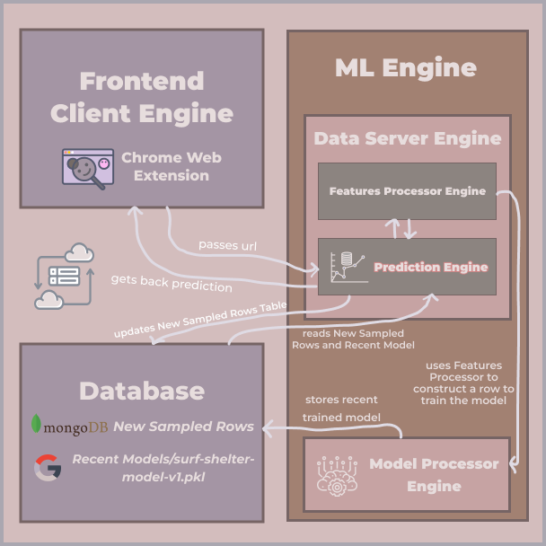
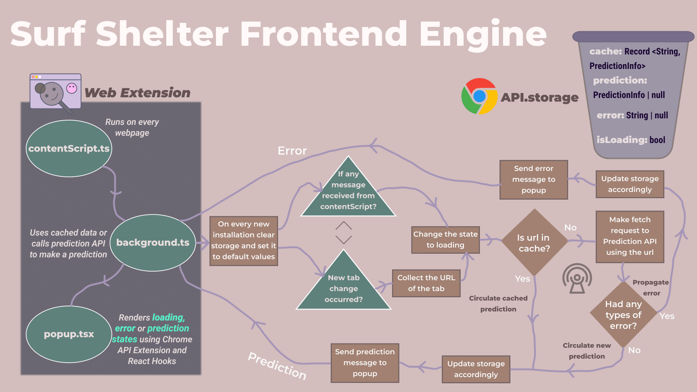
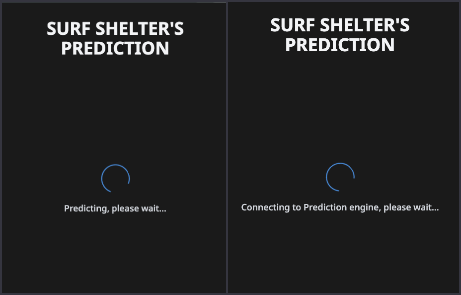
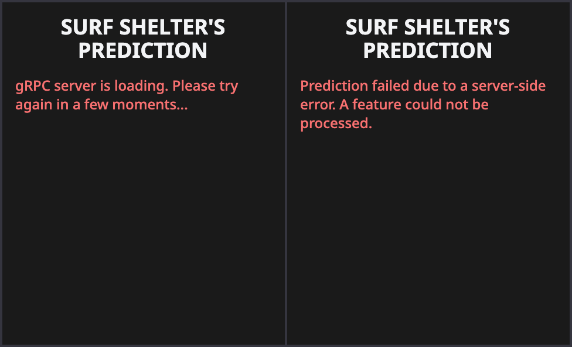
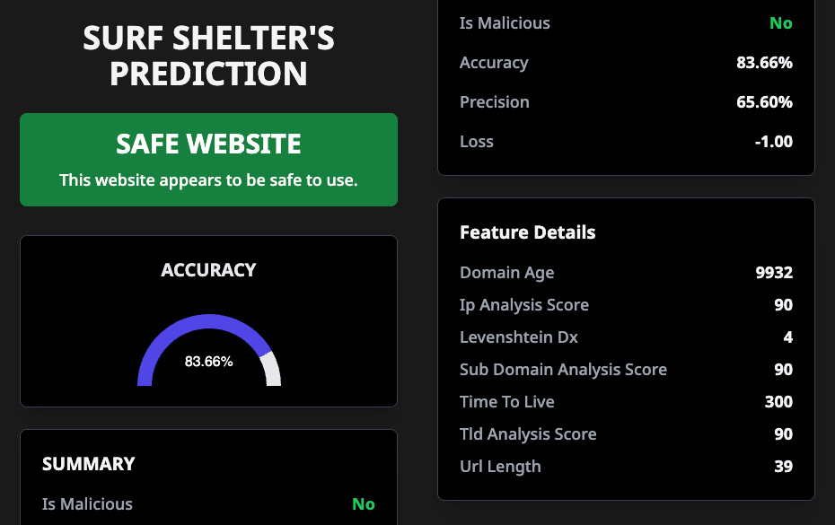

# Surf Shelter 🔍

Surf Shelter is an **intelligent, modular system** designed to classify and filter harmful websites, including those associated with click fraud, pay fraud, and malicious activities ⚠️. It analyzes attributes such as URLs, metadata, and scripts to detect and flag harmful websites (the current iteration only focuses on URLs). The system is scalable and adaptable, seamlessly integrating browser extensions, data collectors, and machine-learning components for real-time detection and ongoing model improvement 🚀🚀🚀.

The following diagram provides a high-level overview of the **system's design** architecture:



**💡 Main Components**
1. [Frontend Client](https://github.com/KarkiAdit/surf-shelter-frontend-client-engine/blob/main/readme.md)
2. [Data Server Engine](https://github.com/KarkiAdit/surf-shelter-data-server-engine/blob/master/README.md)
3. [Model Processor Engine](https://github.com/KarkiAdit/surf-shelter-model-processor-engine/blob/master/Readme.md)

## 🌟 Frontend Client Overview

The Frontend Client Engine serves as the user-facing component of Surf Shelter, implemented as a **Chrome Web Extension.** It performs three fundamental functions:
- ***Retrieving URLs from active browser tabs.***
- ***Sending URLs to the Prediction Engine for analysis.***
- ***Displaying predictions with relevant metrics (e.g., accuracy and p-value) in a user-friendly interface.***

## ✨ Features

- **URL Retrieval and Prediction**: Fetches the active tab's URL and triggers real-time analysis using the [Prediction Engine API](https://github.com/KarkiAdit/surf-shelter-data-server-engine/blob/4b84d31e18fec76e3b81127aa607bee9489365aa/prediction-engine/app/routes.py#L9).
- **Caching Mechanism**: [Local storage](https://github.com/KarkiAdit/surf-shelter-frontend-client-engine/blob/727dfd656fd241e95a16df347f63e9872d1a9037/src/background/background.ts#L26) with Chrome.API.storage.
- **State Management and UI Updates**: Leverages [React Hooks](https://github.com/KarkiAdit/surf-shelter-frontend-client-engine/blob/727dfd656fd241e95a16df347f63e9872d1a9037/src/components/popup.tsx#L7) (useEffect, useState) for dynamic popup updates.
- **Error Handling**: Implements [middleware](https://github.com/KarkiAdit/surf-shelter-frontend-client-engine/blob/727dfd656fd241e95a16df347f63e9872d1a9037/src/background/background.ts#L129) in prediction logic to gracefully handle issues such as server outages, feature processing failures, and model training errors.

## 🗂️ High-Level Design

At a high level, the URL from each active tab is retrieved and sent to the background script. The background script employs **caching** and **state management** to decide whether to use a cached prediction or request a new one from the Prediction Engine. This design ensures optimal performance while reducing redundant API calls.

The following flowchart illustrates the underlying process:



## 🎥 Demo

1. **Loading State**:

   

2. **Errors**:

   

3. **Prediction Display**:

   

## ⚙️ Developer Setup

1. **Clone the Repository**:
   ```bash
   git clone https://github.com/KarkiAdit/surf-shelter-frontend-client-engine.git
   ```
2. **Install Dependencies**: Run the following command to install all required dependencies:
   ```bash
   npm install
   ```
3. **Bundle the Project**: Use Vite's configuration files to bundle the TypeScript project by running
   ```bash
   npm run build
   ```

4. **Build Output**: The bundled files will be available in the `dist` folder, ready for deployment or testing.

5. **Run Locally (Optional)**: For local testing, run the project in development mode.
   Open your browser's extension management page.
   - Enable `Developer Mode`.
   - Load the unpacked extension by selecting the `dist` folder.

## 🧑‍💻 Technologies Used
- **React:** For building the user interface.
- **Tailwind CSS:** For styling and responsive design.
- **TypeScript:** For type-safe and maintainable code.
- **Vite:** For fast project bundling and development.
- **Chrome Extension API:** For communication between the extension and active webpages.

## 📚 Acknowledgments
[Chrome Extensions Docs](https://developer.chrome.com/docs/extensions/get-started/tutorial/hello-world)<br>
[Vite TS Docs](https://vite.dev/guide/)